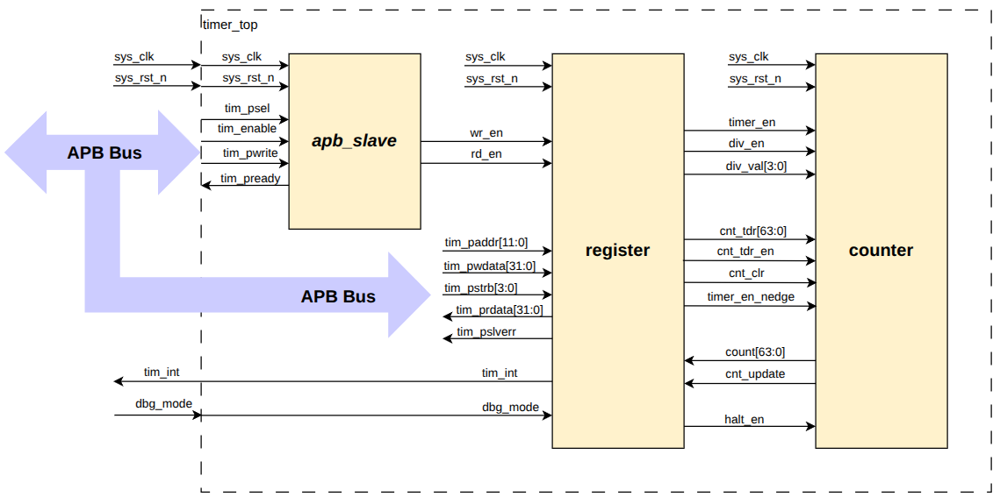

# APB Timer Module

A 64-bit Timer module customized from the CLINT module of industrial RISC-V architecture, using APB (Advanced Peripheral Bus) protocol.

## Overview

APB Timer Module is a 64-bit timer IP core operating as an APB slave, designed for precise time counting and generating periodic interrupts in embedded systems. The module supports multiple flexible operating modes and has good debugging capabilities.

## Features

**Key Features**  

- **64-bit Counter**: Count-up with 64-bit width.  
- **APB Protocol:**  
  - APB slave with 12-bit address.  
  - Wait state support (1 cycle).  
  - Error handling.  
  - Byte access support.  
- **Debug Mode:** Halt support in debug mode.  
- **Reset:** Active low async reset.  
- **Clock Divider:** Counter can count based on system clock or divided up to 256.  
- **Interrupt:** Timer interrupt support (can be enabled/disabled).  

**Technical Specifications**

- 32-bit data transfer support via APB bus.  
- Individual byte access support.  
- Counter continues counting when interrupt occurs.  
- Counter continues counting when overflow occurs.  
- Automatic counter clear when timer is disabled.  

## Directory Structure

```
APB-Timer/  
├── docs/              # Documentation and images  
│   └── Block_diagram.png  
├── rtl/               # RTL source code (Verilog)  
│   └── *.v           # Verilog design files  
├── tb/                # Testbench  
│   └── *.v           # Testbench files  
├── testcases/         # Test cases  
│   └── *.v           # Specific test cases  
├── sim/               # Simulation scripts and files  
└── README.md          # This file  
```

## System Architecture

  

This Timer IP consists of an APB_slave block, a Register block, and a counter block, operating with an active-low asynchronous reset.  
    • APB Slave: Handles protocol handshake, including tim_pready and support wait states 1 cycle.  
    • Register: Stores control and status data to facilitate timer functionality.  
    • Counter: A 64-bit counter module that handles count-up logic and supports clock division; it consists of two sub-blocks: main_counter and sub_counter.  

## Functional Description

**1. APB Slave / Register**

**Features:**

- Read/write to reserved area: RAZ/WI (Read As Zero, Write Ignored).  
- 32-bit transfer support via APB.  
- Byte access support: can access individual bytes in registers.  
- Wait state support (1 cycle) to improve timing.  
- Error handling for prohibited accesses:  
  - Write invalid value to TCR.div_val.  
  - Change div_en or div_val while timer is operating.  
  - When error occurs, data is not written to register.  

**2. Counter**

**Counting modes:**

- Default mode: Counting speed same as system clock.  
- Control mode: When enabled by writing 1 to TCR.div_en, counting speed is determined by divisor value in TCR.div_val.  

**Features:**

- Counter continues counting when interrupt occurs.  
- Counter continues counting when overflow.  
- Halted mode support.  
- When timer_en changes from H->L, counter automatically clears to initial value.  
- div_en and div_val cannot be changed when timer_en is High.  

**3. Halted Mode**

Counter can be halted (stopped) in debug mode when both conditions occur:  
- Input signal debug_mode is High.  
- THCR.halt_req = 1.  

**Features:**

- THCSR.halt_ack = 1 after halt request indicates request is accepted.  
- After halted, counter can resume counting normally by clearing halt request to 0.  
- Period of each counting number is same when halted and not halted.  

**4. Timer Interrupt**

Timer interrupt (tim_int) is asserted when:

- Interrupt is enabled.  
- Counter value matches (equals) compare value.  

Once asserted, timer interrupt remains unchanged until:

- Cleared by writing 1 to TISR.int_st.  
- Or interrupt is disabled.  

## Usage

**Basic steps:**

**Initialize Timer:**

- Reset module (active low).  
- Configure control registers.  

**Configure counting mode:**

- Write value to TCR.div_val if frequency division is needed.  
- Enable div_en if required.  

**Configure Interrupt** (if needed):

- Write compare value to compare register.  
- Enable interrupt.  

**Enable Timer:**

- Set timer_en = 1.  

**Handle Interrupt:**

- When interrupt occurs, handle ISR.  
- Clear interrupt by writing 1 to TISR.int_st.  

## Simulation

**Run Simulation:**

```bash
cd sim/
make all_tc     # run all test case
make all_tc_cov # run all test case with coverage mode
make help       # to more detail 
vi pat.list and type "//" to disable testcase
```

**Test Cases:**

The testcases/ directory contains various test cases to verify:

- APB transfer.  
- Register access.  
- Byte access.  
- Error handling.  
- Basic counting.  
- Clock division.  
- Interrupt generation.  
- Halt mode.  

## Simulator: QuestaSim

## Register Map  
(Detailed register map will be added to documentation in docs/ directory)  
**Main registers:**  
- TCR: Timer Control Register (controls div_en, div_val).  
- TDR: Timer Data Register.  
- TCMP: Timer Compare Register.  
- TIER: Timer Interrupt Enable Register.  
- TISR: Timer Interrupt Status Register (int_st).  
- THCR: Timer Halt Control Register (halt_req).  
- THCSR: Timer Halt Control Status Register (halt_ack).  

